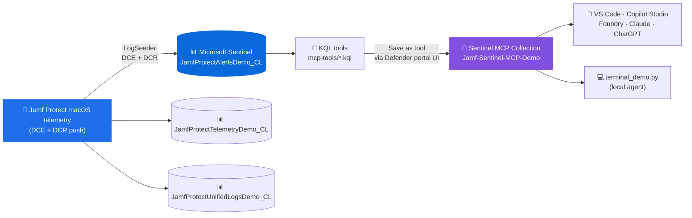

# Jamf Protect Sentinel MCP Demo (UI variant)

This repo is a GitHub-ready reference implementation for a Jamf developer who wants to show an end-to-end Microsoft Sentinel custom MCP tool integration.

The purpose is not to ship another generic chatbot. The purpose is to show how an ISV can expose focused, high-value security capabilities as **MCP tools** over the data they already bring into Microsoft Sentinel. Once those tools exist, a terminal demo, an ISV product experience, a Copilot-style UI, or another agent runtime can call the same capability.

## The story in one sentence

Jamf Protect delivers world-class macOS EDR; MCP turns that telemetry into reusable agent capabilities such as "profile endpoint risk," "hunt prevented executions," "find unsigned binaries," and "watch Gatekeeper events."

## Architecture at a glance



## Recommended path for a live working session

If you are walking through this with a Jamf developer, start here:

[`docs/working-session-guide.md`](docs/working-session-guide.md)

That guide is the most methodical path. It has roles, copy/paste commands, checkpoints, troubleshooting, and the exact places Jamf would customize the pattern for its own platform.

## New to Sentinel? Read this first

| Term | Plain-English meaning |
| --- | --- |
| Microsoft Sentinel | Microsoft's cloud SIEM for collecting logs, detecting threats, investigating incidents, and responding. |
| Log Analytics workspace | The Azure data store Sentinel uses for logs. Think "database for security telemetry." |
| Table | A named set of rows in the workspace. This demo writes to three Jamf `*_CL` tables. |
| KQL | Kusto Query Language, used to search Sentinel logs. |
| LogSeeder | A sample-data tool that creates a table and inserts realistic demo rows. |
| DCE | Data Collection Endpoint: the Azure ingestion URL where custom log data is sent. |
| DCR | Data Collection Rule: the Azure rule that maps incoming data into the right table and columns. |
| MCP tool | A callable tool an agent can use. In this repo, each MCP tool runs one curated KQL query. |

The Codeless Connector Framework (CCF) generates an Azure Monitor DCR that maps inbound Jamf Protect data into ASIM-aligned `*_CL` tables. LogSeeder mirrors that DCE+DCR flow with synthetic data so the same MCP tools work end-to-end without a live Jamf Protect tenant.

## What this demo proves

A Jamf developer can:

1. Start from the official Sentinel Jamf Protect connector DCR.
2. Use Sentinel LogSeeder to create demo custom tables and seed realistic macOS security telemetry.
3. Publish high-value KQL questions as Sentinel custom MCP tools.
4. Call those tools from a simple terminal prompt loop or any future agent runtime.

## Architecture

```text
Official Jamf Protect Sentinel DCR
        |
        v
LogSeeder demo schemas + sample value pools
        |
        v
JamfProtectAlertsDemo_CL / Telemetry / UnifiedLogs in Log Analytics
        |
        v
KQL-backed custom Sentinel MCP tools
        |
        v
Interactive terminal demo that routes natural prompts to those tools
```

## What gets created

| Asset | Created by | Why it exists |
| --- | --- | --- |
| `JamfProtectAlertsDemo_CL` table | LogSeeder | Stores demo Jamf Protect alert rows used by the MCP tools |
| `JamfProtectTelemetryDemo_CL` table | LogSeeder | Stores lower-level Endpoint Security Framework telemetry |
| `JamfProtectUnifiedLogsDemo_CL` table | LogSeeder | Stores Jamf unified-log style events |
| Data Collection Endpoint | LogSeeder/Azure Monitor | Provides the ingestion endpoint for custom logs |
| Data Collection Rule | LogSeeder/Azure Monitor | Maps JSON fields into custom table columns |
| `Jamf-Sentinel-MCP-Demo` collection | `scripts/publish-mcp-tools.py` | Groups the custom MCP tools |
| Nine MCP tools | `scripts/publish-mcp-tools.py` | Expose repeatable Jamf Protect investigation questions |
| Terminal demo | `terminal_demo.py` | Lets a presenter call the tools from a prompt |

## Why this matters for Jamf developers

The developer does not have to guess what an agent might need. They can package a small set of opinionated tools around the macOS endpoint security questions Jamf is best positioned to answer:

| Developer asset | Why it helps |
| --- | --- |
| Official connector DCR | Keeps the demo aligned to Jamf Protect's real Sentinel connector |
| LogSeeder schemas | Let a developer or seller stand up demo data without a live tenant |
| KQL files | Make the security logic inspectable, reviewable, and versionable |
| MCP publisher script | Converts KQL into callable custom tools |
| Terminal demo | Shows the end-to-end tool call without Teams, browser, or admin-consent friction |
| Source annotations | Help a developer understand and customize every moving part |

## Demo tables and schema reference

Primary MCP queries run over `JamfProtectAlertsDemo_CL`. Two companion tables show how the same ingestion pattern supports telemetry and unified-log streams.

| Table | Schema file | Rows in demo | Purpose |
| --- | --- | ---: | --- |
| `JamfProtectAlertsDemo_CL` | `logseeder/JamfProtectAlertsDemo_CL.json` | 400 | ASIM-aligned alert stream for investigations |
| `JamfProtectTelemetryDemo_CL` | `logseeder/JamfProtectTelemetryDemo_CL.json` | 200 | Endpoint Security Framework telemetry stream |
| `JamfProtectUnifiedLogsDemo_CL` | `logseeder/JamfProtectUnifiedLogsDemo_CL.json` | 150 | Jamf unified-log event stream |

Source DCR:

```text
https://github.com/Azure/Azure-Sentinel/blob/master/Solutions/Jamf%20Protect/Data%20Connectors/JamfProtect_ccp/DCR.json
```

The companion file `logseeder/JamfProtectAlertsDemo_CL.annotated.jsonc` explains the primary schema in a comment-friendly format. Keep `JamfProtectAlertsDemo_CL.json` valid JSON for LogSeeder. The column `TargetbinarySignerType` intentionally uses a lowercase `b` to preserve the real DCR column name.

## End-to-end use case

**Use case:** a Mac SOC analyst (or agent on their behalf) needs to triage Jamf Protect alerts, investigate hosts, sweep IOCs across all three Jamf streams, hunt for rare or unsigned binaries, find USB anomalies, map activity to MITRE ATT&CK, and tune noisy detections.

The tools are designed to **chain** in agent workflows. A typical chain:

```
Jamf_Daily_Triage_Queue   → pick the top host
Jamf_Host_Investigation   → drill that host across all 3 Jamf streams
Jamf_IOC_Sweep            → pivot on a suspicious SHA / TeamID / cmdline
Jamf_Process_Lineage      → understand what spawned it
Jamf_MITRE_ATTACK_Coverage → map the day's activity to techniques
```

| Tool | Purpose |
| --- | --- |
| `Jamf_Daily_Triage_Queue` | Ranked queue of alerts to review now. Dedup'd per host+SHA+EventType. Each row has a `TriageScore` (0-100) and a `WhyFlagged` reason array (credential-access, persistence, unsigned-binary, exec-prevented, ...). Unions alerts + unified logs. |
| `Jamf_Host_Investigation` | Per-host triage across alerts + unified logs + telemetry. Counts, signer mix, top processes/parents, analyst-friendly `UnifiedLogMessages`, telemetry volume, `RiskHints`, and a 15-event high-signal timeline. Tune the `HostFilter` let-binding to scope to one Mac. |
| `Jamf_IOC_Sweep` | Cross-stream indicator lookup. Given a SHA prefix, Apple Team ID, hostname fragment, process name, or command-line substring, sweeps alerts + unified logs + telemetry and returns a normalized result with hosts, streams, samples, and a 30-event recent-hits list. |
| `Jamf_Rare_Binary_Hunt` | Surfaces rare, unsigned, or ad-hoc-signed binaries with `Prevalence`, `FleetPrevalencePct`, `Rarity` bucket (Singleton-Untrusted, Rare-Untrusted, Untrusted-Widespread, ...), and `HuntReasons`. Replaces "list every unsigned thing" with "what's actually new and rare". |
| `Jamf_USB_Anomaly_Hunt` | Three USB signals per Mac: `FirstSeenOnHost` (first USB event in window), `RetriedAfterBlock` (block then mount), and `AfterHoursMount` (outside 07-19 UTC). One row per host with `USBAnomalyScore`. |
| `Jamf_Mac_Endpoint_Risk_Profile` | ★ Flagship: per-Mac risk score from severity, prevented executions, unsigned binaries, Gatekeeper/MRT, and USB signals. Ranks Macs so the SOC knows what to investigate first. |
| `Jamf_Process_Lineage` | Parent-child process pair analysis. Surfaces macOS attacker tradecraft: shells from Office/Chrome/Slack, unsigned children, ad-hoc-signed children, rare lineages. `LineageScore` + `LineageReasons`. |
| `Jamf_MITRE_ATTACK_Coverage` | Heuristic macOS MITRE ATT&CK rollup over alerts + unified logs. Maps to techniques like T1547.013 LaunchAgent Persistence, T1056.001 Keylogging, T1052.001 USB Exfiltration, T1059.004 Unix Shell, T1553.001 Gatekeeper Bypass. |
| `Jamf_Alert_Tuning_Candidates` | SOC noise audit. High-volume, mostly-allowed, low-severity signatures that may be suppression / allowlist candidates. `TuningScore` + `TuningReasons` (mostly-allowed, low-severity-heavy, fleet-wide, trusted-signer, no-high-severity). |

For the full narrative and talk track for each tool, see [`docs/tool-use-cases.md`](docs/tool-use-cases.md). Live JSON outputs against the seeded workspace are in [`docs/sample-tool-runs.md`](docs/sample-tool-runs.md) and `docs/sample-runs/`.


## Prompt router

`terminal_demo.py` routes natural prompts to tools with simple keyword matching:

| Prompt contains | Tool selected |
| --- | --- |
| `triage`, `queue`, `top alerts`, `today` | `Jamf_Daily_Triage_Queue` |
| `host`, `investigate`, `deep dive`, `everything` | `Jamf_Host_Investigation` |
| `ioc`, `sweep`, `indicator`, `sha256`, `team id` | `Jamf_IOC_Sweep` |
| `rare`, `unsigned`, `signature`, `ad hoc`, `singleton`, `first seen` | `Jamf_Rare_Binary_Hunt` |
| `usb`, `removable`, `thumb drive`, `after hours` | `Jamf_USB_Anomaly_Hunt` |
| `risk`, `score`, `worst mac`, `vip` | `Jamf_Mac_Endpoint_Risk_Profile` |
| `lineage`, `parent`, `child`, `spawned`, `process tree` | `Jamf_Process_Lineage` |
| `mitre`, `att&ck`, `technique`, `coverage` | `Jamf_MITRE_ATTACK_Coverage` |
| `tuning`, `noisy`, `suppress`, `allowlist`, `false positive` | `Jamf_Alert_Tuning_Candidates` |
| Anything else | `Jamf_Daily_Triage_Queue` |


## Prerequisites

You'll need:

1. **An Azure subscription** with a **Log Analytics workspace** connected to Microsoft Sentinel.
2. **Permission to create custom log ingestion resources** in the workspace resource group.
3. **Azure CLI** authenticated against that subscription:
   ```bash
   brew install azure-cli
   az login
   az account set --subscription "<subscription-id-or-name>"
   ```
4. **PowerShell 7** for LogSeeder:
   ```bash
   brew install --cask powershell
   pwsh --version
   ```
5. **Python 3.9+** for the publishing helper and terminal demo.
6. **`sentinel-logseeder`** cloned locally:
   ```bash
   git clone https://github.com/microsoft/sentinel-logseeder.git
   ```
7. **Permission to publish Sentinel custom MCP tool collections.** The publishing helper calls `https://api.securityplatform.microsoft.com/aiprimitives/mcpToolCollections` and acquires a token for resource ID `4500ebfb-89b6-4b14-a480-7f749797bfcd`.

### Get your workspace customer ID

The publisher and `.env` ask for `<workspace-customer-id>` — the Log Analytics workspace ID (a GUID), not the Azure resource ID:

```bash
az monitor log-analytics workspace show \
  --resource-group <rg> \
  --workspace-name <workspace> \
  --query customerId -o tsv
```

## Seed data with LogSeeder

This step creates the custom tables and sends demo rows into Sentinel. LogSeeder mirrors the DCE+DCR ingestion path used by the Codeless Connector Framework.

```bash
export REPO_ROOT=$(pwd)
export LOGSEEDER=/path/to/sentinel-logseeder

cp "$REPO_ROOT/logseeder/JamfProtectAlertsDemo_CL.json" "$LOGSEEDER/schemas/"
cp "$REPO_ROOT/logseeder/JamfProtectTelemetryDemo_CL.json" "$LOGSEEDER/schemas/"
cp "$REPO_ROOT/logseeder/JamfProtectUnifiedLogsDemo_CL.json" "$LOGSEEDER/schemas/"
cd "$LOGSEEDER"
```

Run three ingestions:

```bash
pwsh -NoLogo -NoProfile -ExecutionPolicy Bypass \
  -File ./scripts/Invoke-SampleDataIngestion.ps1 \
  -TableName JamfProtectAlertsDemo_CL \
  -Schema ./schemas/JamfProtectAlertsDemo_CL.json \
  -RowCount 400 \
  -TimeWindowMinutes 10080 \
  -Deploy -Ingest
```

```bash
pwsh -NoLogo -NoProfile -ExecutionPolicy Bypass \
  -File ./scripts/Invoke-SampleDataIngestion.ps1 \
  -TableName JamfProtectTelemetryDemo_CL \
  -Schema ./schemas/JamfProtectTelemetryDemo_CL.json \
  -RowCount 200 \
  -TimeWindowMinutes 10080 \
  -Deploy -Ingest
```

```bash
pwsh -NoLogo -NoProfile -ExecutionPolicy Bypass \
  -File ./scripts/Invoke-SampleDataIngestion.ps1 \
  -TableName JamfProtectUnifiedLogsDemo_CL \
  -Schema ./schemas/JamfProtectUnifiedLogsDemo_CL.json \
  -RowCount 150 \
  -TimeWindowMinutes 10080 \
  -Deploy -Ingest
```

Verify rows:

```kql
JamfProtectAlertsDemo_CL
| summarize RowCount=count(), FirstSeen=min(TimeGenerated), LastSeen=max(TimeGenerated)
```

```kql
JamfProtectTelemetryDemo_CL
| summarize RowCount=count(), FirstSeen=min(TimeGenerated), LastSeen=max(TimeGenerated)
```

```kql
JamfProtectUnifiedLogsDemo_CL
| summarize RowCount=count(), FirstSeen=min(TimeGenerated), LastSeen=max(TimeGenerated)
```

If a query returns zero rows immediately after ingestion, wait a few minutes and query again. New custom tables and DCR mappings can take time to become queryable.

## Publish MCP tools

Prepare Python:

```bash
cd "$REPO_ROOT"
python3 -m venv .venv
source .venv/bin/activate
pip install -r requirements.txt
```

Publish each `.kql` file as a custom MCP tool **via the Microsoft Defender
portal UI** — no script needed. Step-by-step walkthrough:

[`docs/publish-tools-via-ui.md`](docs/publish-tools-via-ui.md)

Each `.kql` file becomes one custom MCP tool. The tool is a safe, reusable question over the Sentinel table.

## Run the terminal demo

Configure real mode:

```bash
cp .env.example .env
# edit .env and set MCP_DEFAULT_ARGUMENTS to your workspace customer ID
python3 terminal_demo.py --show-raw
```

Or practice offline with deterministic mock output:

```bash
MCP_DEMO_MODE=mock python3 terminal_demo.py --prompt "Show Mac endpoint risk profile" --show-raw
```

Paste these prompts:

```text
Summarize Jamf Protect alert posture
Hunt for prevented executions
Find unsigned binary activity
Show USB storage events
Show Mac endpoint risk profile
Watch Gatekeeper and MRT events
```

## Troubleshooting

| Problem | What to do |
| --- | --- |
| `az` auth fails | Run `az login`, then set the right subscription. |
| LogSeeder succeeds but no rows | Wait a few minutes and rerun the verification query. |
| Custom table schema mismatch | Confirm JSON files are valid and `TargetbinarySignerType` uses lowercase `b`. |
| MCP publish fails | Confirm the account can manage Sentinel MCP tool collections. |
| Tool publish says description missing | Make sure every `.kql` stem exists in `DESCRIPTIONS` in `scripts/publish-mcp-tools.py`. |
| Terminal demo has no workspace | Fix `MCP_DEFAULT_ARGUMENTS` in `.env`. |
| Tool returns no rows | Re-seed data or widen the KQL time window. |
| Real mode connection fails | Use `MCP_DEMO_MODE=mock` for presenter practice, then troubleshoot Sentinel MCP auth separately. |

## Files

| Path | Purpose |
| --- | --- |
| `logseeder/source-schema-url.txt` | Official Jamf Protect DCR source URL |
| `logseeder/JamfProtectAlertsDemo_CL.json` | Primary valid LogSeeder schema for alert data |
| `logseeder/JamfProtectAlertsDemo_CL.annotated.jsonc` | Commented companion explaining alert columns |
| `logseeder/JamfProtectTelemetryDemo_CL.json` | Valid LogSeeder schema for telemetry data |
| `logseeder/JamfProtectUnifiedLogsDemo_CL.json` | Valid LogSeeder schema for unified logs |
| `mcp-tools/*.kql` | Six Sentinel queries published as MCP tools |
| `scripts/publish-mcp-tools.py` | Publishes the MCP tool collection and KQL tools |
| `sentinel_mcp_demo/client.py` | Reusable Sentinel MCP client |
| `sentinel_mcp_demo/mock.py` | Offline deterministic MCP client |
| `terminal_demo.py` | Prompt router and presenter terminal demo |
| `.env.example` | Required environment variables |
| `docs/working-session-guide.md` | Copy/paste session plan for Microsoft + Jamf calls |
| `docs/demo-script.md` | Presenter script |
| `docs/tool-use-cases.md` | Per-tool deep dive |
| `docs/sample-tool-runs.md` | Live JSON output from every tool against a real Sentinel workspace (May 2026) |
| `docs/publish-tools-via-ui.md` | UI walkthrough — save each KQL as a custom tool via the Defender portal |
| `docs/connector-reference.md` | Jamf connector and DCR mapping reference |

## Suggested close

After the terminal demo works, decide which Jamf product surface should call these tools: an investigation button, an analyst prompt, an incident detail panel, or a backend automation workflow. The core pattern stays the same: Jamf-shaped Sentinel data, curated KQL, published MCP tools, and an agent or app that calls them.
